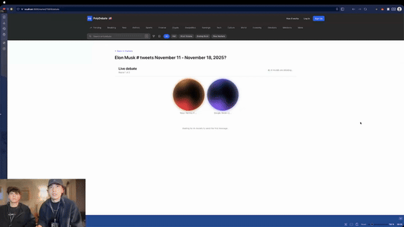

# Konstantin Savkin

Software Engineer and AI Engineer, backend-first. I build data-heavy backends and the AI layers that sit on top of them.

[savkin.dev](https://savkin.dev) &nbsp;·&nbsp; [LinkedIn](https://linkedin.com/in/ksavkin) &nbsp;·&nbsp; [k.e.savkin@gmail.com](mailto:k.e.savkin@gmail.com)

## What I'm building now

- **Zyp** (fintech, cross-border payments) - backend on the payments platform: PostgreSQL/Supabase schema design, row-level security, Deno edge functions, and v1 of an agentic AI assistant.
- **Next League** (sports tech) - data and analytics layer for major US sports organizations: a TimescaleDB time-series store, Payload CMS, a Next.js 16 app, and an LLM-powered analytics surface.

## Things I've shipped

- **SwiftLabel** - a keyboard-first image labeling tool for ML engineers, published on [PyPI](https://pypi.org/project/swiftlabel/) ([source](https://github.com/ksavkin/SwiftLabel)).
- **1st place, BeaverHacks 2026** and **3rd place, QuackHacks 2025** (out of 112 teams) for [PolyDebate](https://github.com/bazarkua/polydebate), an AI debate platform wired to live prediction-market data.

  

- **ML research at Warren Lab (Oregon State)** - production ML running on edge devices, trained and evaluated over 1.5M+ frames.

  

## Stack

Python · TypeScript · PostgreSQL · Supabase · Deno · Next.js · TimescaleDB · PyTorch

## Reach me

[savkin.dev](https://savkin.dev) &nbsp;·&nbsp; [linkedin.com/in/ksavkin](https://linkedin.com/in/ksavkin) &nbsp;·&nbsp; [k.e.savkin@gmail.com](mailto:k.e.savkin@gmail.com)

CS @ Oregon State University
