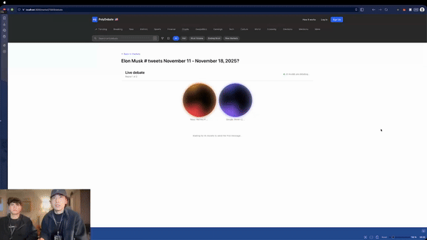
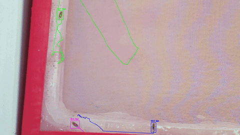
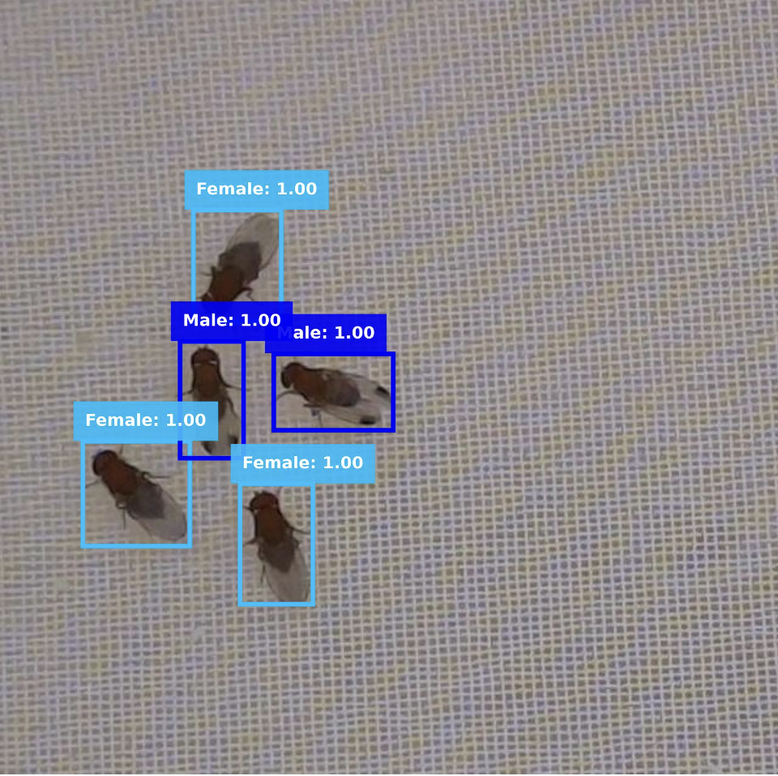

# Hi, I'm Konstantin Savkin 👋

[](https://linkedin.com/in/ksavkin)
[](mailto:k.e.savkin@gmail.com)
[](https://github.com/ksavkin)

## 🎓 About Me

**Computer Science Student** @ **Oregon State University** | **GPA: 3.97/4.0** | Sophomore (2nd Year)

I'm passionate about **Machine Learning**, **Computer Vision**, and **Backend Engineering**. Currently working on ML research at Warren Lab, focusing on image classification and object detection for biological research applications.

```python
class KonstantinSavkin:
    def __init__(self):
        self.location = "Corvallis, OR"
        self.education = "Oregon State University - Computer Science"
        self.gpa = 3.97
        self.current_focus = ["Machine Learning", "Computer Vision", "Backend Engineering"]
        self.current_role = "Laboratory Assistant @ Warren Lab"

    def get_interests(self):
        return {
            "AI/ML": ["Computer Vision", "Image Classification", "Object Detection"],
            "Backend": ["RESTful APIs", "Database Design", "System Architecture"],
            "Tools": ["TensorFlow", "PyTorch", "Flask", "SQLAlchemy", "SQL"]
        }
```

## 🏆 Recent Achievements

### 🥉 QuackHacks 2025 Hackathon - 3rd Place (out of 112 participants)
**Team Project**: [PolyDebate](https://github.com/bazarkua/polydebate) | [DevPost](https://devpost.com/software/polydebate)

> **🏆 Awarded 3rd Place Overall** out of 112 participants.
> **Prize**: Resume circulation to the **Polymarket** engineering team.



AI-powered debate platform integrating 100+ AI models with real-time prediction market data and TTS narration.

#### 🏗️ System Architecture

```ascii
+----------------+       +---------------------------+       +------------------+
|  User / Client | <---> |      Flask Backend        | <---> |     Database     |
| (Next.js / UI) |       | (Orchestrator / API)      |       | (PostgreSQL/SQL) |
+----------------+       +---------------------------+       +------------------+
                                      ^  ^  ^
                                      |  |  |
             +------------------------+  |  +-------------------------+
             |                           |                            |
+-------------------------+   +--------------------------+   +------------------+
|     Polymarket API      |   |      OpenRouter API      |   |  ElevenLabs API  |
| (Real-time Market Data) |   | (LLM Debate Generation)  |   | (Text-to-Speech) |
+-------------------------+   +--------------------------+   +------------------+
```

**My Contributions** (Backend/API Focus):
- **Polymarket Integration (Critical)**:
    - Engineered the ingestion pipeline for **Polymarket's CLOB (Central Limit Order Book) API** to fetch real-time event probabilities.
    - Implemented logic to inject live market sentiment (e.g., "65% Yes") into LLM contexts, forcing AI debaters to ground arguments in current market reality.
- **Backend Architecture**: Built the core Flask orchestrator managing the flow between 3 external APIs (Polymarket, OpenRouter, ElevenLabs) and the frontend.
- **Real-time Streaming**: Implemented Server-Sent Events (SSE) to stream debate chunks and audio URLs instantly to the client, reducing perceived latency to near-zero.
- **Database Design**: Designed the schema to store debate history, user votes, and market snapshots for historical analysis.
- **Delivered**: 24-hour development sprint from concept to working product.

### 🔬 Machine Learning Research - Warren Lab (OSU)
**Position**: Laboratory Assistant | Computer Science Department | February 2025 - Present

**Trajectory Tracking & Behavioral Analysis System:**

- Developed real-time trajectory tracking system for behavioral analysis of biological specimens during movement
- Implemented computer vision pipeline to classify specimens and visualize movement paths with color-coded trajectories
- Created automated visualization tool that tracks spatial coordinates and renders continuous movement patterns
- Enhanced research workflow by enabling simultaneous classification and spatial-temporal behavioral analysis

**ResNet-50 Classification Model:**

- Engineered ResNet-50 deep learning model achieving **98.24% test accuracy** on 3-class biological specimen classification
- Developed custom training pipeline with data augmentation (rotation, flipping, color jittering, contrast adjustment) on 850+ image dataset
- Applied advanced tiling techniques for fine-grained feature detection in microscopic image analysis
- Improved model accuracy from initial baseline to **93%** through systematic hyperparameter tuning and architecture optimization
- Curated balanced dataset (~450 samples per class) ensuring robust model generalization across morphological variations
- Authored technical report documenting ResNet architecture, training methodology, and evaluation metrics

**Detection Model Project:**
- Annotated **1,000+ images** across 3 classes for object detection training
- Automated labeling pipeline achieving **99.6% time reduction** (20s → 74ms per image)
- Implemented YOLO-based detection model for automated biological specimen identification

**BeeMachine Parser:**
- Designed and implemented parser for large-scale ML dataset processing
- Automated error analysis and misclassification flagging for model improvement
- Enhanced research workflow efficiency through data pipeline automation

## 💻 Tech Stack

### Languages


### Machine Learning & AI


### Backend & Databases


### Tools & Frameworks


## 📊 Featured Projects

### 🤖 [PolyDebate](https://github.com/bazarkua/polydebate) - AI Debate Platform
> **QuackHacks 2025 Winner (3rd/112)** | Team Project | Backend + AI

AI-powered debate simulation platform integrating 100+ AI models with real-time text-to-speech narration

**Technologies**: Python, Flask, SQLAlchemy, TypeScript, Next.js, OpenRouter API, ElevenLabs API

**My Backend Contributions**:
- Flask backend architecture with 8-table database schema
- RESTful API design (15+ endpoints) with JWT authentication
- External API integration (OpenRouter, ElevenLabs, Polymarket)
- Real-time SSE streaming implementation
- Database design and ORM modeling with SQLAlchemy

**Stats**: 111 commits | 3 contributors | 24-hour development

---

### 🎓 [Universities Database Project](https://github.com/ksavkin/universities_db_project)
> **Complete SQL Database Design** | Solo Project

Comprehensive 8-table relational database for university information with advanced SQL queries

**Technologies**: SQL, SQLite, dbdiagram, DBeaver

**Features**:
- 8-table normalized database schema
- 12 example queries demonstrating SQL mastery
- Advanced techniques: CTEs, window functions, JOINs, transactions
- Complete documentation with visual database diagram

**Status**: ✅ Fully documented and complete

---

### ♟️ [Blind Chess Player](https://github.com/ksavkin/blind_chess_player)
> **Educational Project** | Yandex Lyceum (2021)

Blindfold chess training app with Telegram bot and Yandex Station voice interface

**Technologies**: Python, Telegram Bot API, Yandex Voice API, Chess Engine

**Features**:
- Dual-platform support (Telegram + Voice)
- Chess engine with move validation
- Hint system with board visualization
- Voice-controlled hands-free gameplay

---

## 🔭 Currently Working On

- 🧪 **Warren Lab ML Research**: Image classification and object detection for biological research
- 🎓 **University Coursework**: Data Structures, Algorithms, Database Systems
- 💡 **Side Projects**: Building ML model deployment pipelines and backend systems

## 🌱 Currently Learning

- Advanced Computer Vision and Deep Learning architectures
- Distributed systems and scalable backend design
- Cloud deployment for ML models (AWS SageMaker, Azure ML)
- Advanced SQL optimization and database design patterns

## 📫 How to Reach Me

- **Email**: [k.e.savkin@gmail.com](mailto:k.e.savkin@gmail.com)
- **LinkedIn**: [linkedin.com/in/ksavkin](https://linkedin.com/in/ksavkin)
- **GitHub**: [@ksavkin](https://github.com/ksavkin)
- **Location**: Corvallis, OR

## 💼 Open to Opportunities

I'm actively seeking **Summer 2026 internships** in:
- **Machine Learning / AI Engineering**
- **Computer Vision / Research**
- **Backend Engineering (Python/Flask/FastAPI)**
- **Data Engineering / MLOps**

---

⭐️ From [ksavkin](https://github.com/ksavkin) | GPA: 3.97/4.0 | Oregon State University CS
